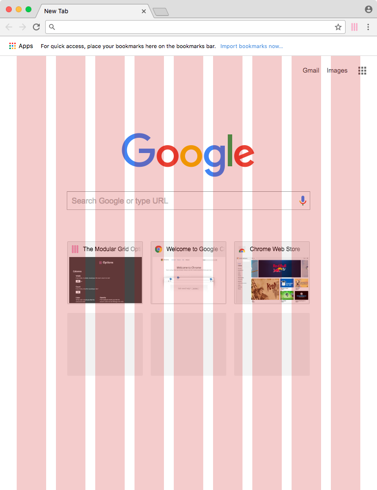
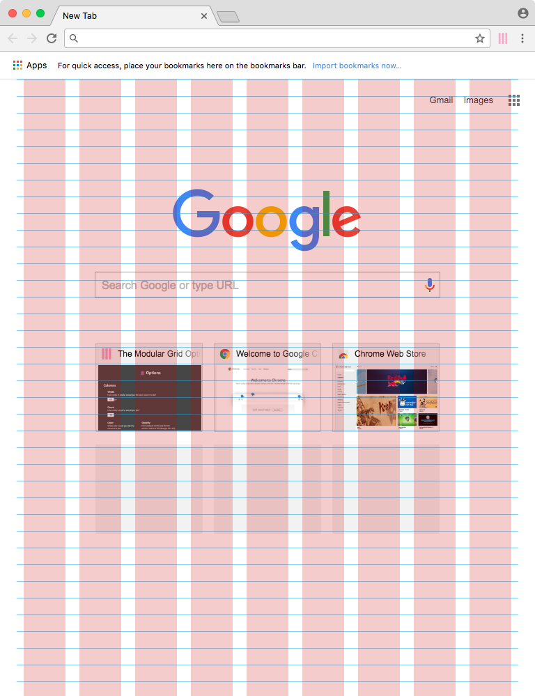

slidenumbers: true
autoscale: true
build-lists: true
theme: next, 3
footer: The Modular Grid: A Chrome Extension (in beta)

[.hide-footer]

# The Modular Grid: A Chrome Extension (in beta)

Roy Vanegas

## ITP Camp 2017
## New York, NY
## 5 June 2017

^
* Get WiFi password
* Check projector resolution: 1080p, 1080i, and 720p: 16:9 (78%); 4:3 (33%). Set aspect ratio under the Presentation menu.
* Fill water bottle
* Have markers and eraser at the ready

---

## [fit] Links (if you’d like to follow along)

**Slides** [http://bit.ly/github-tmgp](http://bit.ly/github-tmgp)
**Extension** [http://bit.ly/github-tmg](http://bit.ly/github-tmg)
**Demo** [Folder](https://github.com/code-warrior/the-modular-grid-presentation/tree/master/demo)

I’ll show these links again at the end of the talk.

---

[.hide-footer]

## [fit] Hi!

* I’m Roy
* I teach web programming and design
* I sometimes work in the private sector

---

[.hide-footer]

## [fit] Agenda

1. Who the target audience is for this talk/demo
2. What is The Modular Grid
3. How to install it
4. How to use it with Sass
5. Do a demo
6. Q & A

^ Feel free to interrupt at any point.

---

[.hide-footer]

## [fit] Who’s The Target Audience?

* Web developers looking for near-perfect pixel translations of design comps
* Web developers with a basic understanding of Sass
* Web designers who want to verify work done by the web dev team

---

[.hide-footer]

## [fit] What is The Modular Grid?

It’s a Chrome extension (in beta) that overlays a column grid, baseline (or leading) grid, and a modular grid over web pages.

---

[.footer: What is The Modular Grid?]

### [fit] A Column Grid



---

[.footer: What is The Modular Grid?]

### [fit] A Baseline — or Leading — Grid


---

[.footer: What is The Modular Grid?]

### [fit] A Modular Grid



---

[.footer: What is The Modular Grid?]

### [fit] The Current Options Include

* Defining the width of each column
* Defining the amount of columns
* Defining the color of the column
* Defining the column color’s opacity
* Defining the width of each gutter
* Defining whether the user wants split gutters
* Defining the color of the baseline
* Defining the distance between baselines (leading)

---

[.hide-footer]

## [fit] Installation

There are two ways to install the extension:

* [Via the GitHub Desktop Client](https://github.com/code-warrior/the-modular-grid#github-desktop-installation)
* [Via the command line](https://github.com/code-warrior/the-modular-grid#command-line-installation)

---

[.footer: Installation]

### [fit] CLI Install

I’ll discuss installation via the command line.

---

[.footer: Installation]

### [fit] CLI Install Steps

1. `git clone git@github.com:code-warrior/the-modular-grid`
2.  Launch Chrome and bring up the extensions page: `chrome://extensions`
3. Locate `the-modular-grid` folder created in step 1.
4. Drag the `extension` folder over the Chrome Extensions window.

---

[.hide-footer]

## [fit] Using the Extension with Sass

I configure Sass for use with the extension as follows:

1. A reset CSS document
2. A handful of variables
3. A simple scaffold to hold everything together

---

[.footer: Using the Extension with Sass]

### [fit] Reset CSS

First, in order to achieve optimal precision, I use a modified version of Eric Meyer’s Reset CSS to reset all styling coming from the browser:

[https://github.com/code-warrior/reset-css](https://github.com/code-warrior/reset-css)

---

[.footer: Using the Extension with Sass]

### [fit] Reset CSS

This reset document is included as a partial in `main.scss`.

````scss
@import 'reset-css';
````

---

[.footer: Using the Extension with Sass]

### [fit] Sass Variables

Now the variables.

---

[.footer: Using the Extension with Sass]

### [fit] Sass Variables

Let’s use 60 pixels for the column:

```scss
$grid--column-width: 60px;
```

---

[.footer: Using the Extension with Sass]

### [fit] Sass Variables

And 20 pixels — or a third of a column — for the gutter:

```scss
$grid--column-width: 60px;
$grid--gutter-width: 20px; // or ($grid--column-width / 3)
```

---

[.footer: Using the Extension with Sass]

### [fit] Sass Variables

A grid unit is defined as a column plus a gutter:

```scss
$grid--column-width: 60px;
$grid--gutter-width: 20px; // or ($grid--column-width / 3)
$grid--unit: ($grid--column-width + $grid--gutter-width); // 80 pixels
```

---

[.footer: Using the Extension with Sass]

### [fit] Sass Variables

We’ll set leading (or baseline distance) to 24 pixels:

```scss
$grid--column-width: 60px;
$grid--gutter-width: 20px; // or ($grid--column-width / 3)
$grid--unit: ($grid--column-width + $grid--gutter-width); // 80 pixels
$grid--leading: 24px;
```

---

[.footer: Using the Extension with Sass]

### [fit] Sass Variables

And all the variables can go in `_grid-variables.scss` or as a subset of the variables in `_variables.scss`.

---

[.footer: Using the Extension with Sass]

### [fit] Sass Variables

Now `main.scss` looks like:

````scss
@import 'reset-css';
@import 'grid-variables';
````

And we’re ready.

---

[.hide-footer]

## [fit] Demo Time

<br>


---

[.footer: Using the Extension with Sass]

### [fit] Suggestions

Any ideas or suggestions?

Submit an [issue via GitHub](https://github.com/code-warrior/the-modular-grid/issues), using the `suggestion` label, in addition to any other appropriate label.

---

[.footer: Using the Extension with Sass]

### [fit] What Else is Out There?

* [Susy](http://susy.oddbird.net/)
* [W3C CSS Grid Layout Module](https://www.w3.org/TR/css-grid-1/)
* [960 Grid System](https://960.gs/)
* [The Bootstrap Grid Chrome extension](https://chrome.google.com/webstore/detail/bootstrap-grid/gmoboekiodfcajledjijioecfimliddo?hl=en)
* [The eBay Design Grid Overlay Chrome extension]( https://github.com/eBay/Design-Grid-Overlay)

---

[.hide-footer]


---

[.hide-footer]

## [fit] Q & A

^ Go right to the next slide so the links hover in the background as people ask questions

---

[.hide-footer]

## [fit] Links

**Extension** [http://bit.ly/github-tmg](http://bit.ly/github-tmg)

**GitHub** [http://bit.ly/github-cw](http://bit.ly/github-cw)

**Twitter** [http://bit.ly/twitter-rv](http://bit.ly/twitter-rv)

**This deck** [http://bit.ly/github-tmgp](http://bit.ly/github-tmgp)

---

[.hide-footer]
[.footer: Credits]
[.build-lists: false]

## [fit] Credits

__Demo Time__ GIF: [https://giphy.com/gifs/2iD7ptAltEgyk/](https://giphy.com/gifs/2iD7ptAltEgyk/)

__Thank You__ GIF: [https://giphy.com/gifs/86nJuFHH25Uu4/](https://giphy.com/gifs/86nJuFHH25Uu4/)
